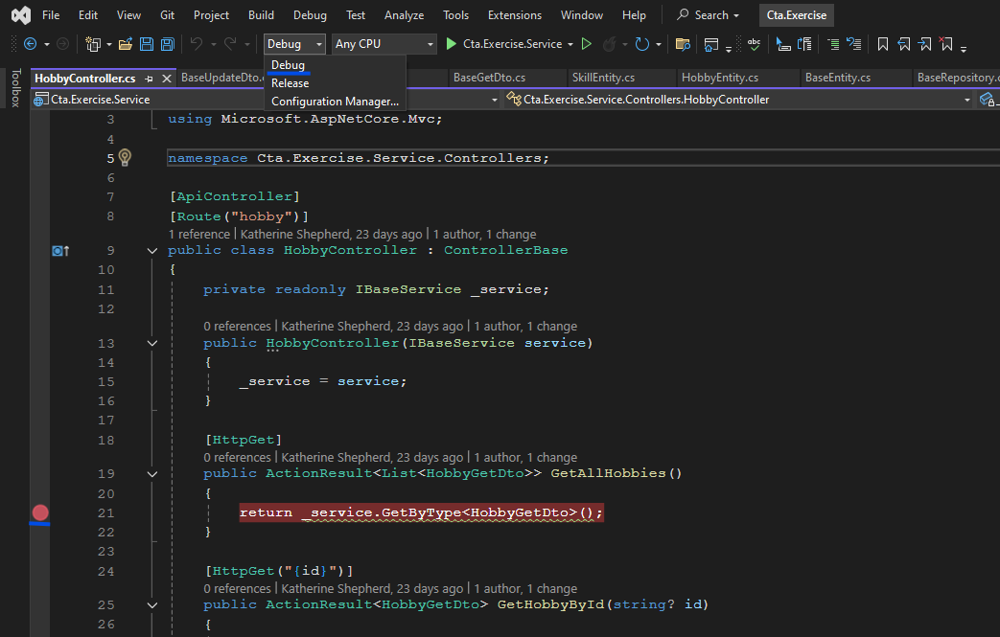
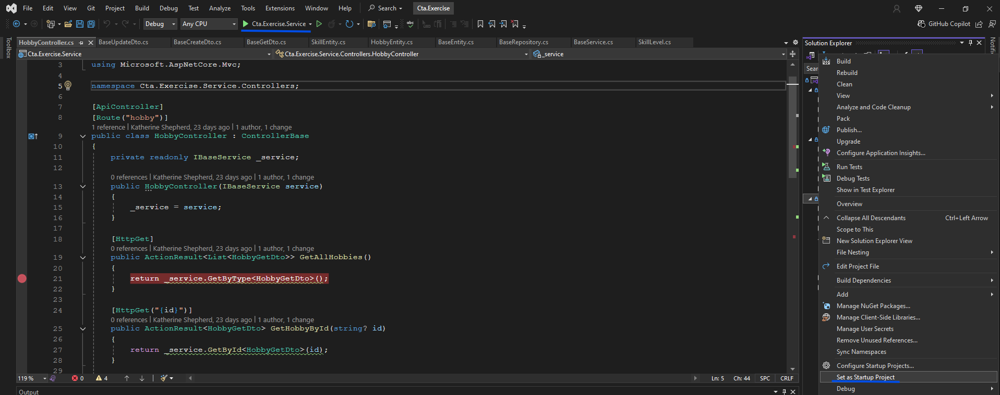
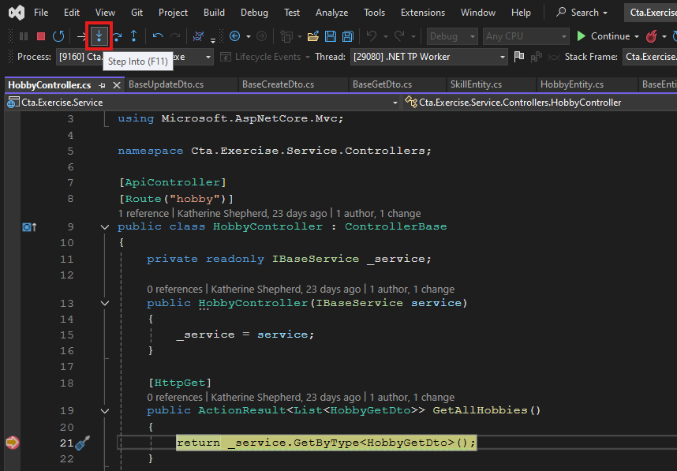
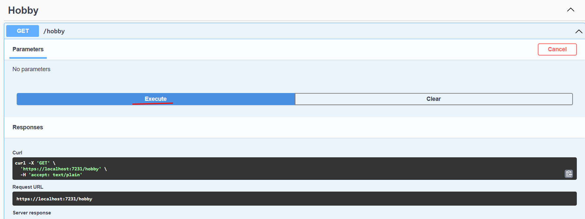
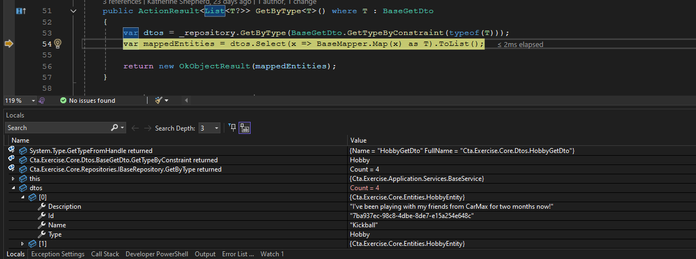

# cta-csharp-exercise

- [Background](#background)
- [Part 1: Get All Skills/Hobbies](#part-1-get-all-skillshobbies)
- [Part 2: Get Skill/Hobby By Id](#part-2-get-skillhobby-by-id)
- [Part 3: Create/Update Skill/Hobby](#part-3-createupdate-skillhobby)
- [Part 4: Create Service](#part-4-create-service-client)
- [Bonus Missions](#bonus-missions)

## Background
The purpose of this exercise is for you to extend the provided starter API that manages "skills" and "hobbies".
  - Implementing CRUD-like endpoints for a simple model
  - Using a generic service class to handle logic for multiple data types
  - Connecting your API controller to your service using dependency injection
  - Experiencing basic C# and .NET patterns (controllers, services, DI, generics)

Read through the files in Cta.Exercise.Core. You won't have to edit any of them but you will need to understand them to complete this exercise.

> ** Take 2-3 minutes to skim these files. Note the use of interfaces and the “generics” keyword (`<T>`).

### Repositories

Repositories are what hold data, think of them as the code entryway to a database.

- BaseRepository:
  - Instead of connecting to a real repository, the BaseRepository is acting as a wrapper for a list holding the data
  - There are several pre-loaded skills and hobbies that will be present any time you run the program
  - This is a local list so any time you restart the service, skills and hobbies you've added will be removed

### Entities

Entities are the data models that we store directly in a database.

- BaseEntity:
  - The base entity is an abstract class that will be implemented by our Skill and Hobby entities. It contains all the fields that are required but leaves the option for classes implementing it to add more fields.
    - Id: string to identify entity
    - Type: enum that identifies the implemented type (skill or hobby)
    - Name: string
    - Description: string

- HobbyEntity: implements the BaseEntity with no additional fields, declares type as Hobby

- SkillEntity: implements the BaseEntity and declares the type as Skill. Includes an additional field "SkillLevel". This is another enum to represent how much experience you have with a given skill

### DTOs

DTOs (data transfer objects) are the versions of a model that a client will interact with directly. It often has fewer fields than the entity that it represents since there is some data a client shouldn't be able to see (on GetDtos) and some data a client shouldn't be able to edit (on CreateDtos and UpdateDtos).

- BaseCreateDto/BaseUpdateDto: contains fields for Name and Description since those are the only fields that should be set by the user
  - Why have different DTOs for Create and Update if they're the exact same? It's good practice to have separate models so if later down the line something changes, you don't have to separate when things are more complicated.

- BaseGetDto:
  - Id
  - Name
  - Description
  - There is a method used to determine the specific type implementation of the abstract type. This can generally be ignored. It's used as part of the internal mechanics of the mapper class, which you won't need to edit.

## Part 1: Get All Skills/Hobbies

- This part of the code for hobbies is already completed. You should debug the code to see how it runs.

### Step 1: Set breakpoint on line 21 of Cta.Exercise.Service/Controllers/HobbyController.cs and make sure Solution Configuration is set to Debug.
|  |
| -- |

### Step 2: Make sure Cta.Exercise.Service is set as the startup project and update it if it's not. Then, you can click on the filled in green triangle to run the project.
|  |
| -- |

:warning: If you get a certificate warning in your browser during the next step, this is normal for local development and you should be able to continue by clicking past the warning or having visual studio create a certificate for you.

### Step 3: The swagger request page should automatically open in another window. Click execute for GET /Hobby to get a list of all hobbies loaded into the system (some have been pre-loaded into the repository). This should locally call the endpoint in your controller and you can step through each class that is run. Return to Visual Studio for debugging. Click on 'Step Into' in the top left corner of the screen to continue to the next step. Make sure to look through the value of variables as you debug.

### Step 4: Continue debugging and try experimenting with deleting a hobby and see how the data is manipulated

### Step 5: Get All and Delete are implemented in the HobbyController but haven't been setup in the SkillController yet. Open that file and work to set that up then test it.

## Part 2: Get Skill/Hobby by Id

- In this section, we'll be allowing clients to retrieve a specific skill/hobby based on its id. Work through implementing `GetById()` in BaseService and when all the work is done, run the project again to test it. Feel free to add breakpoints and debug to see how it works.

### Requirements
- Get entity by id from repository
- Check if the entity is null and if so, return `new NotFoundResult()`
- If the entity isn't null, map it from an entity to a DTO and return result as a `new OkObjectResult()`
- HINT: look to the `GetByType()` method for guidance on how to use the BaseMapper and return the results

## Part 3: Create/Update Skill/Hobby

- In this section, we'll be allowing clients to create and update skills and hobbies. Work through implementing `Create()` and `Update()` in BaseService and when all the work is done, run the project again to test it. You should find that these two methods are very similar. Feel free to add breakpoints and debug to see how it works.

### Requirements
- Check if either of the name/description fields are empty and if so, return `new BadRequestResult()`
- Confirm there is no other skill/hobby that already has the name of the new request, if there is an existing entity with that name, return `new BadRequest()`
- Map from the DTO to an entity (for updating, you'll need to pass in the DTO and the id)
- Create/update the entity in the repository
- Map the entity that has been created/updated into a GetDto and return it as a `new OkObjectResult()`

## Part 4: Create Service Client

- This section is unrelated to your hobbies and skills controllers and instead will be showing you how to call an API like the one that you've been creating.

### Cat Facts Example
Step through and debug the CatFact endpoint in the ServiceClientController. Specifically, observe how the service client utilizes an [HttpClient](https://learn.microsoft.com/en-us/dotnet/api/system.net.http.httpclient?view=net-9.0) and is able to call GetAsync with the URI to get a response back. The response is parsed and deserialized after confirming the request was successful.

### Random Facts Implementation
Implement the random fact service client and then test it through swagger.
- Base address is already set in program file on line 22
- The endpoint to append at the end in the HttpClient's get call is "/api/v2/facts/random"
- Deserialize to `RandomFactResponse`
- Return the text field of the deserialized response

## Bonus Missions
Did you finish this exercise early? Are you bored? Maybe you just found out you'll be on a backend team and want to be prepared! Here are a few ideas you can work on independently to improve your project. These ideas aren't required and do not have an answer key but if you attempt them and run into any issues, please reach out to your instructor!

P.S. - if you think of your own way to continue this project, please report back so future CTAs can learn from what you do and it can be added as an idea to this section!

- Add new field(s) to some of the entities (CreatedDate, UpdatedDate, something more creative than what I can think of)
  - Update entity, DTOs, and mapper
- Create sorting/filtering mechanism for results (alphabetical, most recently updated/created, etc.)
  - Review [LINQ](https://learn.microsoft.com/en-us/dotnet/csharp/linq/standard-query-operators/sorting-data) and modify results in `GetByType()`
- Create new implementation of Base classes (e.g. Person)
  - Create entity, DTOs, and new controller
  - Update mapper
  - You won't have to edit the service class because generics are awesome
- Create a JSON reader/writer so changes persist across sessions
  - Add an empty json file to be written to
  - Use a [json reader](https://learn.microsoft.com/en-us/dotnet/standard/serialization/system-text-json/use-utf8jsonreader) and [json writer](https://learn.microsoft.com/en-us/dotnet/standard/serialization/system-text-json/use-utf8jsonwriter) to save and retrieve data as a persistent local database (use System.Text.Json, not Newtonsoft for serialization)
  - Later in the project, persistent data will be added through cosmos db but this is more for the coding experience and to allow the repository to work locally
- Create another service client and call one of [these](https://github.com/public-apis/public-apis?tab=readme-ov-file#animals) public APIs
  - Choose an API without auth and test that the endpoint actually works and see what the response structure is. You can look back at the cat facts and random facts APIs to see how the URL and endpoint were determined
  - Inject service client in Program file in the same manner the other service clients are (specifying the http client's base address)
  - Reference cat and random fact service clients for guidance